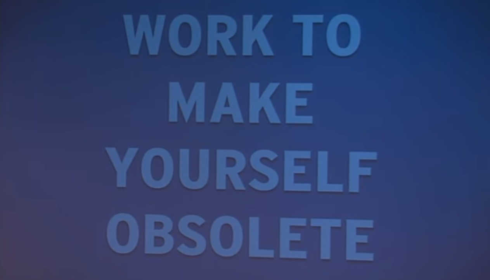

# PCD2019

---
<!-- # hello world -->

---
<!-- # collscreen pantalla -->

---
<!-- collscreen calle -->

---?image=http://abelardogfournier.org/cms/files/cache/canal-plus-xtra-skyline-visualizacion-television-croopier.800x600_0.jpg
<!-- # skyline imagen -->
---
<!-- skyline rutas -->

---
<!-- skyline edificios -->

---
<!-- skyline quadtree -->

---
<!-- # skyline lineas -->

---
<!-- # skyline completo -->

---
<!-- # tamal resultado -->

---
<!-- # tamal esquema -->

---
<!-- # tamal participantes -->

---
<!-- # pedercini -->
#### Paolo Pedercini, GFC2014

---

